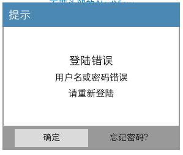
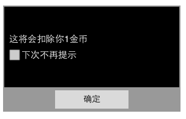
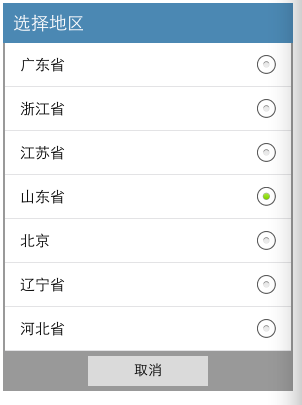
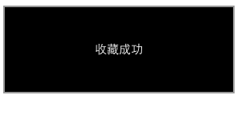
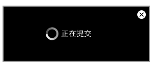

YsqAlertView
============

一个丰富的弹出视图。可以自己定制alertView的风格。

###使用

将ClassAndImage文件夹拉入你的工程之后

```objc
#import "YsqAlertView.h"
```

###弹出层

####风格1



```objc
YsqAlertView *alert = [[YsqAlertView alloc]initWithHeadText:@"提示"
                                                      title:@"登陆错误"
                                               labelTextArr:@[@"用户名或密码错误",@"请重新登陆"]
                                                 btnTextArr:@[@"确定",@"忘记密码？"]
                                            btnClickInIndex:^(int index, NSString *info) {
                                            	NSLog(@"index = %d,info = %@",index,info);
                                            }
                                                     option:NSTextAlignmentCenter]; //option属性是设置提示框中文字的排版
    
alert.lastBtnIsOnlyText = YES;
[alert show];
```

####风格2



```objc
YsqAlertView *alert  =[[YsqAlertView alloc]initWithHeadText:nil
                                                      title:nil
                                               labelTextArr:@[@"这将会扣除你1金币",@"下次不再提示"]
                                                 btnTextArr:nil
                                            btnClickInIndex:^(int index, NSString *info) {
                                            	NSLog(@"index = %d,info = %@",index,info);
                                            }
                                                     option:NSTextAlignmentLeft];
    
alert.lastTextLabelWithCheckBox = YES;
[alert show];
```

####风格3



```objc
YsqAlertView *alert = [[YsqAlertView alloc]initWithHeadText:@"选择地区"
                                                      title:nil
                                               labelTextArr:@[@"广东省",@"浙江省",@"江苏省",@"山东省",@"北京",@"辽宁省",@"河北省",@"广西省",@"湖南省",@"湖北省"]
                                                 btnTextArr:@[@"取消"]
                                            btnClickInIndex:^(int index, NSString *info) {
                                            	NSLog(@"index = %d,info = %@",index,info);
                                            }
                                                     option:NSTextAlignmentLeft];
    
    
alert.type = AlertViewWithTable;
alert.cellAccessoryType = AlertViewCellWithAccessoryView;
alert.cellInitSelectIndex = 3;
//    alert.tableViewCellBgColor = someColor;
//    alert.tableViewCellFontColor = someColor;
//    alert.tableViewCellTouchColor = someColor;
[alert show];
```

###警告层

####风格1



```objc
YsqAlertView *alert = [[YsqAlertView alloc]initWithWarningString:@"收藏成功"
                                                withLoadingImage:NO
                                                       durations:1
                                                      endWarning:^{
                                                           NSLog(@"自动隐藏了");
                                                      }];
[alert show];
```

####风格2



```objc
YsqAlertView *alert = [[YsqAlertView alloc]initWithWarningString:@"正在提交"
                                                withLoadingImage:YES
                                                 withCloseButton:YES
                                                      endWarning:^{
                                                          NSLog(@"手动隐藏");
                                                      }];
[alert show];
```


